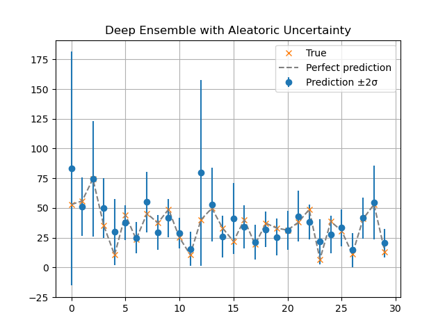
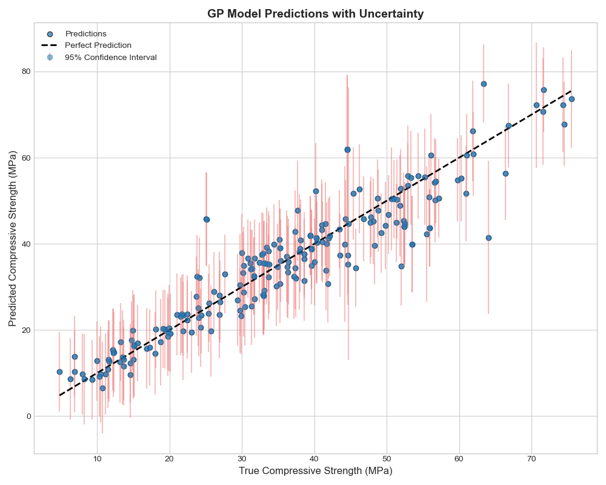

# 🏗️ Probabilistic Regression Models for Structural Engineering

[](https://www.python.org/)
[](https://pytorch.org/)
[](https://scikit-learn.org/)
[](https://opensource.org/licenses/MIT)

> Predicting concrete compressive strength with uncertainty-aware machine learning models for safer, risk-informed decision making in engineering.

---

## 📌 Overview

This repository implements **two powerful probabilistic regression models** to estimate concrete compressive strength — not just as a single number, but with principled uncertainty bounds. This is critical in high-stakes fields like structural engineering, where understanding risk is as important as making accurate predictions.

The two models explored are:
1.  **Deep Ensembles:** A state-of-the-art deep learning method that disentangles data and model uncertainty.
2.  **Gaussian Processes:** A non-parametric Bayesian approach ideal for smaller, tabular datasets.

---

## 🔍 Models Implemented

### 1. 🧠 Deep Ensemble with Aleatoric Uncertainty

A state-of-the-art deep learning ensemble approach that models both:

-   **Aleatoric Uncertainty**: Noise inherent in the data.
-   **Epistemic Uncertainty**: Uncertainty due to limited data/model ignorance.

#### ✅ Key Features
-   📊 **Disentangled Uncertainty** — Separates data noise from model uncertainty.
-   🧪 **Robust Predictions** — Ensemble averaging improves stability and accuracy.
-   🚀 **Scalable & Modern** — Built on PyTorch and suited for real-world deployment.

#### 📈 Results
The model generates predictions with combined uncertainty bounds (±2σ), useful for structural safety evaluations.


---

### 2. ⚙️ Gaussian Process (GP) Regression

A non-parametric Bayesian approach that is particularly effective for the dataset size used in this problem.

#### ✅ Key Features
-   **Probabilistic by Nature** — Models a distribution over functions, providing a statistically grounded confidence interval.
-   **Excellent on Small Data** — Achieves high performance without the need for massive datasets.
-   **Optimized Kernel** — Uses a composite RBF and WhiteKernel to model complex relationships and noise.

#### 📈 Results
The model achieves a high R² score and provides well-calibrated 95% confidence intervals for its predictions.


---
---

## 🛠️ Getting Started

### Prerequisites
Ensure you have a Python environment with the following packages installed.

```bash
# Install required packages
pip install torch numpy pandas scikit-learn matplotlib tensorboard
